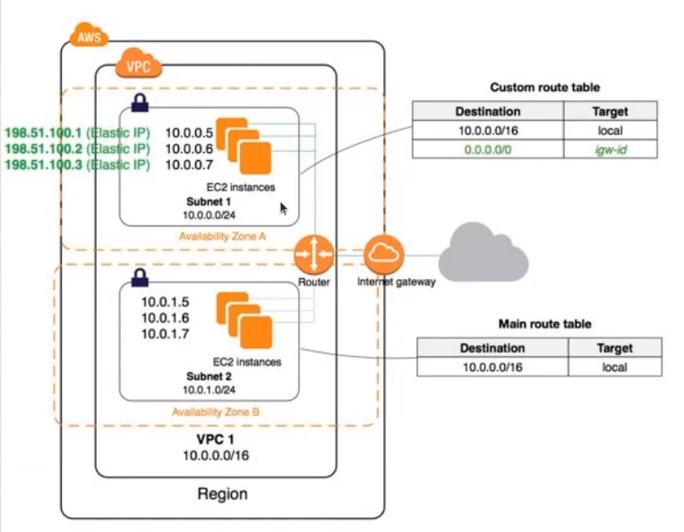

# TP 1 - Automatisation de l'installation d'un site web sur AWS

L'objectif de ce TP est de créer un script qui va installer une application web en PHP / SQL sur AWS dans l'infrastructure suivante : 
* un VPC 
* une instance EC2 sous Linux

Ce script comportera des commandes AWS-CLI pour créer l'ensemble des ressources nécessaires et déployer le site.



## Création des ressources
* Mettre dans le scripts les commandes AWS CLI pour faire les actions suivantes : 
  * Création du VPC
  * Création du groupe de sécurité (ouverture port 22 pour le SSH + 80 pour le web)
  * Création de l'instance EC2 


## Consignes de déploiement de l'application
* Se connecter
* Elle a besoin d'Apache2, de PHP7 ainsi que des extensions de PHP et d'une BDD ici nous installons mysql , voici la commande pour installer l'ensemble des outils :
```
yum install httpd openssl php-common php-curl php-json php-mbstring php-mysql php-xml php-zip
yum install mysql-server
service mysqld start
mysqladmin -u root create blog
mysql_secure_installation
```
* Se positionner dans le dossier web (/var/www/html)
* Récupérer l'archive et la décompresser : 
```
cd /var/www/html
wget http://wordpress.org/latest.tar.gz
tar -xzvf latest-fr_FR.tar.gz . 
```
* Se rendre à l'URL de l'instance et suivre les étapes d'installation de Wordpress

* (Si nécessaire la procédure d'installation détaillé d'un Wordpress sur une instance EC2 est ici: https://crunchify.com/setup-wordpress-amazon-aws-ec2/ )

-> Votre site est prêt

-> Pensez à envoyer votre script (ou le lien vers un dépôt) et une capture avec l'URL de votre site installé sur le Teams

## Pour aller plus loin : 

* Il est possible d'automatiser l'installation de wordpress en utilisant wp-cli : https://wp-cli.org/fr/ 
* Rajouter au script cette partie avec l'installation de l'utilitaire et son utilisation 
* Remplacer la BDD local sur l'instance EC2 par une instance mariadb sur Amazon RDS


## INFORMATION A AJOUTER :

# Détail des actions

# Pour le VPC création de l'ensemble des éléments réseau nécessaire :

-> Nous vous invitons à définir des variables pour les éléments qui se répète : région, nom, plage d'IP Puis à récuper l'id des éléments crée dans de nouvelles variables pour pouvoir les réutiliser facilement

- Définition d'une zone (attention, chaque zone est limité à 5 VPC)
- Création d'un vpc
- Création d'un sous-réseau public
- Création d'un sous-réseau privé
- Création d'une passerelle internet
- Rattachement de la passerelle internet au VPC
- Création d'une table de route
- Création d'une route vers la passerelle internet
- Association du sous-réseau public à la table de route
- Activer l'auto-assignation des IP sur le sous-réseau public pour que l'on puisse accéder à l'instance par la suite

# Pour l'instance EC2 :

- Création d'une paire clé SSH
- Définition des bons droits sur la clé SSH
- Création du groupe de sécurité
- Ajout d'une règle pour le SSH (port 22)
- Ajout d'une règle pour le HTTP (port 80)
- Lancement de l'instance
- Récupération de l'IP de l'instance
- Connexion SSH

-> Il ne vous reste plus qu'à déployer votre application